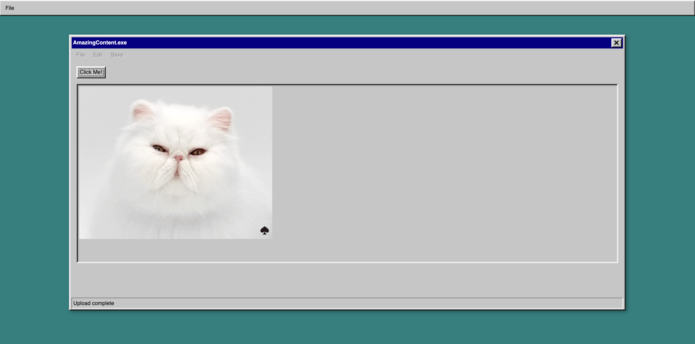
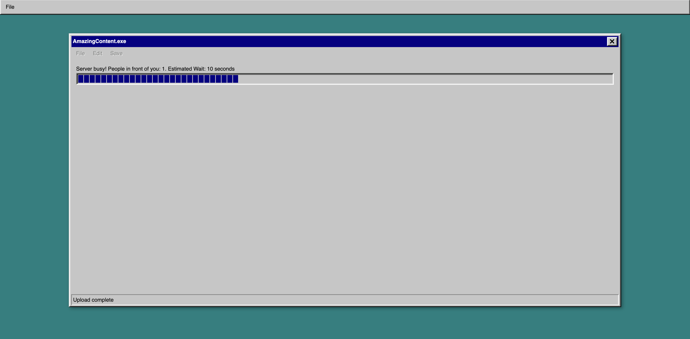

# Exclusive Website

Exclusive website is a website that allows one visitor at a time and handles a queue with the people waiting to visit the website.

Content state:

Queue State:

## Running The Project

1. `npm install`
2. `npm run build`
3. `npm start`

Visit the website on `localhost:8080`

## Tech

- Front-end uses React/TypeScript and Socket.IO
- Back-end uses Nodejs, Express/Typescript and Socket.IO

## Developing

The front-end part of the project is built with React, you can run it by calling `npm start` from the `/exclusive` directory. The application runs by default on port 3000.

The back-end is built with express and you can run it by calling `npm start` from the `/exclusive/server` directory. The application runs by default on port 8080.
